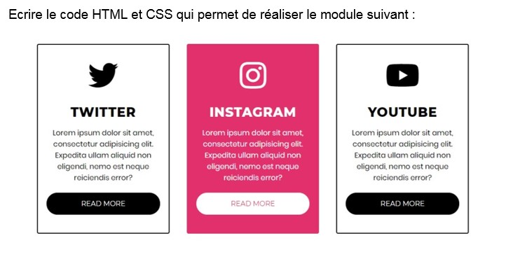

<!--FRONT END TEST | -->


<picture> 
<a href="https://media.giphy.com/media/SWoSkN6DxTszqIKEqv/giphy.gif" alt="karimelaissaouy">

</a>
</picture>

```js
"use test";
import { Candidate } from 'Exam';

new Candidate({
    name   : 'KARIM',
    academy : 'Oxford Academy ',
    exam   : 'FrontEnd',
    center : 'https://oxfordacademytd.co.uk',
    passed : 'Done 100%',
}).Passed();
```

```cmd
I'm thrilled to announce that I have successfully passed the front-end test from the Oxford Academy, achieving a remarkable score of 100%. This accomplishment reflects my dedication, skill, and depth of understanding in front-end development. I am excited about the opportunities this success will open for me in the world of web development & web design
```

# Frontend Test


## Exercise 1 <br> 
<p>
  <code>The role of HTML is to...</code><br>
    - [ ] Format text <br>
    - [x] Organize content <br>
    - [ ] Create e-commerce websites
</p>
<p>
  <code>To define a title WITHIN an HTML page, We use...</code><br>
    - [ ] The title element<br>
    - [ ] The head element<br>
    - [x] An h1, h2, ... h6 element
</p>
<p>
 <code>Which CSS property is used to change the background color of an element?</code> <br>
    - [ ] color <br>
    - [x] background-color <br>
    - [ ] border-color
</p>

<p>
  <code>When you use the '<a>' element, you must specify...</code><br>
    - [ ] An attribute target<br>
    - [x] An attribute href<br>
    - [ ] Two attributes href and target
</p>

<p>
  <code>Which elements are necessary to create an unordered list?</code><br>
    - [x] ul and li <br>
    - [ ] ol and li <br>
    - [ ] ul and ol

</p>

<p>
  <code>What is the purpose of the alt attribute of the img element?</code><br>
    - [x] To provide a description of the image if it cannot be displayed <br>
    - [ ] To provide an alternative link to the image if the first one is broken <br>
    - [ ] To display a second image if the first one cannot be displayed

</p>

<p>
  <code>What property in CSS is used to change the color of text?</code><br>
    - [ ] font-family <br>
    - [ ] text-align <br>
    - [x] color
</p>

<p>
  <code>Which CSS property is used to control the spacing between lines of text?</code><br>
    - [ ] text-align <br>
    - [x] line-height <br>
    - [ ] margin 
</p>

<p>
  <code>Which HTML tag is used to create a hyperlink?</code> <br>
    - [x] a <br>
    - [ ] link <br>
    - [ ] href
</p>

<p>
  <code>Which CSS property is used to make text bold?</code> <br>
    - [ ] font-weight <br>
    - [x] font-style <br>
    - [ ] text-decoration
</p>

<p>
  <code>Which CSS property is used to add space around an element's content, inside of its border?</code> <br>
    - [ ] padding <br>
    - [ ] margin <br>
    - [x] border-spacing 
</p>
<br>
<p>
<code>Write the HTML and CSS code that allows you to create the following module:</code>
<br>
  
</p>
<br>


<br>

### Live :


https://github.com/KARIMELAISSAOUY/Frontend_Oxford_Academy_Test/assets/118484209/680b4f09-562b-4b5a-be89-ba36b1a43ee8


<div align="center">

**Final Result: 👨‍💻** 

```text
⭐️ HTML                   Passed successfully✔️        █████████████████████████   100 %
⭐️ CSS                    Passed successfully✔️        █████████████████████████   100 % 
⭐️ PRACTICAL              Passed successfully✔️        █████████████████████████   100 %  
⭐️ THEORETICAL            Passed successfully✔️        █████████████████████████   100 %  
```

</div>


<p align="center">
<a href="https://skillicons.dev">

</a>
</p>


<div align="center">
    Made with ❤️ By <a href="#">KARIM</a>
</div>


